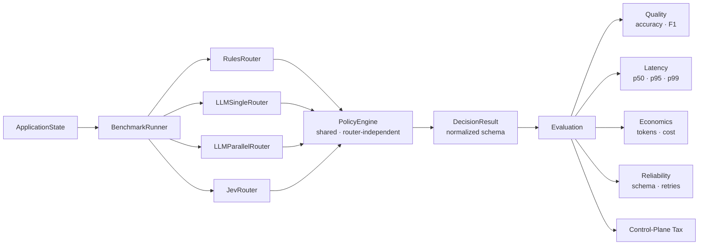

# JEVROUTE

### Measuring the Economics of System-One Intelligence

**A reproducible benchmark for the cost of structured AI decisions.**

> When AI systems spend computation *deciding what to do* rather than *generating what to say*, what does that intelligence cost?


---

## Research Question

> For structured software decisions under identical workloads, schema, policy, and concurrency — how do deterministic rules, single-call LLM reasoning, parallel LLM reasoning, and Jev differ in latency, token usage, reliability, correctness, and cost?

JevRoute exists to answer that question with reproducible, auditable measurements rather than vendor assertions.

The benchmark **does not assume any system wins**. It measures where each mechanism is preferable under controlled conditions.

---

## The Problem

A typical AI application contains many structured decisions adjacent to generation:

```
classify severity       assess policy risk       validate tone
determine action        check hallucination       route the request
```

Each decision can introduce:

- Model API calls
- Token consumption
- Latency and queuing
- Schema validation overhead
- Retry logic and backoff
- Orchestration coordination

This overhead is the **Control-Plane Tax** — the fraction of total AI cost and latency consumed by the decision layer rather than the generation layer.

JevRoute asks a precise question: can a dedicated System-One decision primitive (Jev) change the economics of that tax, and by how much, under what workloads?

The claim is not made in advance. The benchmark measures it.

---

## Four Systems

| System | Description | Model Calls | Cost Floor |
|--------|-------------|-------------|-----------|
| **Rules** | Deterministic keyword/regex baseline | 0 | $0.000 |
| **LLM Single** | One structured LLM call; all dimensions in one pass | 1 | per-token |
| **LLM Parallel** | Six independent async LLM calls; one per decision dimension | 6 | 6× per-token |
| **Jev** | Specialized System-One decision primitive | 1 | OQ-002 unresolved |

**Rules** establishes the zero-cost lower bound. **LLM Parallel** represents a competent async implementation, not a strawman. **LLM Single** represents the current common practice. **Jev** is the system under study.

> The benchmark does not assume Jev is superior. The experiment is designed to measure when different decision mechanisms are preferable under controlled workloads.

---

## Architecture



All four routers receive identical `ApplicationState`. All four produce identical `DecisionResult` schema. All four pass through the same `PolicyEngine`. No router receives special downstream treatment.

---

## Decision Schema

Every router produces a single normalized output:

```json
{
  "severity":           "P1 | P2 | P3 | P4",
  "category":           "Billing | Bug | Feature | Account | Other",
  "policy_violation":   true | false,
  "hallucination_risk": 0.0 – 1.0,
  "tone_risk":          0.0 – 1.0,
  "action":             "SEND | HOLD | ESCALATE"
}
```

Confidence/probability fields (`brier_score`, `ece`) are `null` for systems without native probability outputs and are never manufactured.

---

## Shared Policy Engine

All routers share the same deterministic policy layer (`support-policy-1.0`). Policy is applied **after** router inference, **before** evaluation. No router receives custom policy treatment.

Policy rules (priority order):

```
1. policy_violation = True       → HOLD
2. action == ESCALATE            → ESCALATE
3. severity == P1                → ESCALATE
4. hallucination_risk >= 0.8     → HOLD
5. otherwise                     → router's original action
```

The policy version is recorded in every benchmark result. Changing the policy invalidates historical comparisons and requires a new policy version identifier.

---

## Experiment Matrix

| Experiment | Research Question | Systems |
|------------|-------------------|---------|
| `baseline-v1` | Four-way baseline: quality, latency, cost, reliability | Rules / LLM Single / LLM Parallel / Jev |
| `scaling-v1` | How do cost and latency scale with decision count (2→4→6→8→12)? | All |
| `fastpath-v1` | Does deterministic gating reduce Jev call volume for trivial inputs? | Jev + FastGate variants |
| `context-v1` | What does additional context in the prompt cost in tokens and quality? | LLM Single / Jev |
| `dependency-v1` | What does decision dependency cost vs. independent parallel decisions? | LLM Parallel / Jev |
| `e2e-v1` | When control-plane cost is combined with generation cost, what is the end-to-end tax? | All + generation |

Experiment configurations: [`experiments/`](experiments/)

---

## What We Measure

### Quality
- Per-dimension accuracy (action, severity, category)
- Macro F1
- Bad-send rate · Over-escalation rate · Missed policy violation rate
- Schema validity rate

### Performance
- `p50` · `p95` · `p99` latency (via `time.perf_counter()`, never wall-clock approximation)
- Decision throughput (decisions/second)

### Economics
- Input tokens · Output tokens per decision
- Cost per decision · Cost per 1,000 decisions · Cost per correct decision
- **Control-Plane Tax** = control-plane cost / total AI request cost
- **Decision Density** = decisions per generation request

### Reliability
- Schema failure rate
- Retry rate (bounded, recorded, never hidden)
- Timeout rate
- Calibration: Brier score · ECE (where applicable)

Every failed request remains in results. Failures are never dropped or silently excluded.

---

## Current Benchmark Status

| Component | Status | Notes |
|-----------|--------|-------|
| Benchmark infrastructure | **READY** | 157 tests passing |
| Dataset infrastructure | **READY** | Splitter, freezer, quality gate, validator |
| Synthetic dataset | **READY** | 500 examples · 75 frozen test examples |
| Dataset quality gate | **PASS** | No leakage detected |
| Rules harness validation | **MEASURED LOCALLY** | 75/75 schema valid · 2026-09-20 |
| LLM execution (gpt-4o-mini) | **BLOCKED** | `credit_balance_exhausted` · HTTP 429 |
| Jev execution | **BLOCKED** | `JEV_API_KEY` not configured · OQ-001 / OQ-002 unresolved |
| Full four-way baseline | **PENDING** | Awaiting provider unblock |

The benchmark infrastructure is complete and has been validated against the rules-only path. The full four-way empirical run cannot execute until LLM billing and Jev credentials are available. **No benchmark evidence has been fabricated to compensate for this.**

### Unblock Actions

```
UA-001: Add OpenAI billing credits at https://platform.openai.com/settings/organization/billing/
UA-002: Obtain JEV_API_KEY + confirm JEV_BASE_URL (OQ-001 / OQ-002)
UA-003: Optional — provide external research dataset (500+ labeled examples)
```

---

## Locally Measured Evidence

The following values are **locally executed** (not full benchmark results):

**Rules harness validation — 2026-09-20 — `results/harness_validation_rules_only.json`**

| Metric | Value | Note |
|--------|-------|------|
| Test examples | 75 | Frozen test set · `synthetic_support_v1` |
| Schema valid | 75 / 75 | 100% — all records valid |
| Failures | 0 | |
| Model calls | 0 | Deterministic router |
| Action accuracy | **90.7%** | Primary operational metric |
| Severity accuracy | 42.7% | Rules baseline — severity classification is harder |
| Category accuracy | 68.0% | |

This is a harness validation run, not a full benchmark result. It confirms the infrastructure works end-to-end. LLM and Jev values are not yet measured.

---

## Interactive Demo

JevRoute includes a populated research dashboard combining genuinely executed local measurements with clearly labeled projections for externally blocked providers.

```
cd dashboard && npm install && npm run dev
# → http://localhost:3000
```

The dashboard header shows a **LIVE / DEMO** toggle. In Demo mode, a persistent banner reads:

> **DEMO VERSION** — Based on actual executed empirical values locally

Every metric carries a provenance badge:

| Badge | Meaning |
|-------|---------|
| `● MEASURED` | Value from locally executed harness validation |
| `◌ ESTIMATED` | Deterministic projection from benchmark config + pricing model |
| `△ BLOCKED` | Provider currently unavailable; value not yet observable |

Demo mode state persists across page loads via `localStorage`.

### Demo Data Isolation

Projected LLM and Jev figures are **demonstration projections only** — not empirical benchmark results. They are isolated to:

```
dashboard/app/demo/benchmarkDemoData.ts
```

and are never written into:

```
results/
results/raw/*.jsonl
results/aggregate/*.csv
```

Demo values must never be interpreted as executed measurements.

### Nine Dashboard Surfaces

| Tab | Content |
|-----|---------|
| Overview | Experiment status · Provider health · System KPIs |
| Comparison | Router performance matrix · Latency bars · Quality × Cost scatter |
| Cost Curve | Intelligence cost curve · Latency/cost/tokens vs. decision count |
| Economics | Control-plane tax · E2E breakdown · Fastpath projection |
| Reliability | Schema failure rates · Retry rates · Reliability table |
| Runs | Executed run cards with provenance labels |
| Dataset | Dataset metadata · Label distributions · Freeze status |
| Methodology | Research question · Fairness rules · Decision schema |
| Reproducibility | Experiment metadata · Run commands · Result storage layout |

---

## Dataset

```
datasets/
├── raw/                              ← source data (JSONL)
├── train/                            ← 70% split
├── validation/                       ← 15% split
└── test/                             ← 15% split (frozen)
    └── synthetic_support_v1.jsonl    ← 75 examples, frozen 2026-09-20
```

**Current dataset: `synthetic_support_v1`**

- 500 examples · rule-based synthetic labels · support-ticket workload
- 350 train / 75 validation / 75 test
- Test set frozen at hash prefix `9c6919c5fb883c3a`
- Quality gate: **PASS** · Leakage: **None detected**

**This dataset is synthetic.** Ground-truth labels are generated by deterministic rules, not human annotation. The external research dataset (1,000–2,000 labeled examples) required for the intended empirical program is not yet available. Current results on this dataset reflect harness validation, not research-scale benchmark outcomes.

The test split is frozen and must not be used to tune prompts, rules, thresholds, or policies.

See [`docs/DATASET.md`](docs/DATASET.md) for construction protocol and limitations.

---

## Reproducibility

Every benchmark run carries versioned metadata:

```
dataset_version          dataset_hash
code_commit_sha          router_version
prompt_version           schema_version
policy_version           model / provider identifier
experiment_config        benchmark_timestamp
concurrency              environment metadata
```

Raw JSONL records are append-only and never modified after a run completes. Aggregate results are derived; they are never manually edited.

See [`docs/REPRODUCTION.md`](docs/REPRODUCTION.md) for full reproduction instructions.

---

## Repository Structure

```
.
├── src/jevroute/
│   ├── models/          ← ApplicationState, DecisionResult, enums
│   ├── routers/         ← base protocol + 5 implementations (Rules, LLM×2, Jev, Mock)
│   ├── policy/          ← shared PolicyEngine (router-independent)
│   ├── benchmark/       ← runner, recorder, loader, config
│   ├── evaluation/      ← quality, latency, cost, calibration, throughput
│   ├── datasets/        ← validator, splitter, freezer, quality gate, CLI
│   ├── experiments/     ← e2e and fast_path experiment runners
│   ├── readiness/       ← preflight gate + provider smoke tests
│   └── api/             ← FastAPI application (results, status, datasets)
├── dashboard/           ← Next.js research observatory (TypeScript)
│   └── app/
│       └── demo/        ← isolated demo data layer (never in canonical results)
├── datasets/            ← raw, train, validation, test splits + freeze manifests
├── experiments/         ← YAML experiment configurations (6 experiments)
├── results/             ← raw JSONL, aggregate CSV, metadata, readiness artifacts
├── reports/             ← FINAL_MVP_REPORT.md
├── release/             ← release artifacts and methodology documentation
├── docs/                ← REPRODUCTION, DATASET, OPEN_QUESTIONS, PHASE_PLAN, etc.
├── tests/               ← unit, integration, benchmark (157 tests)
├── CLAUDE.md            ← strict engineering contract (Level 1 authority)
└── JevRoute_MVP_Technical_Architecture.md  ← Level 1 authority
```

---

## Technology Stack

**Backend**

| Component | Technology |
|-----------|-----------|
| Language | Python 3.11+ |
| API framework | FastAPI 0.111+ · Uvicorn |
| Data validation | Pydantic 2.7+ · Pydantic Settings |
| HTTP client | HTTPX (async) |
| Data processing | pandas · pyarrow · JSONL / CSV |
| Evaluation | scikit-learn · NumPy · SciPy |
| Configuration | YAML · python-dotenv |
| Testing | pytest · pytest-asyncio · pytest-httpx |
| Linting | ruff |

**Frontend**

| Component | Technology |
|-----------|-----------|
| Framework | Next.js 16 (App Router) |
| Language | TypeScript |
| Styling | Tailwind CSS |
| Charts | Pure inline SVG (no chart library dependencies) |

---

## Quick Start

**Requirements:** Python 3.11+ · Node.js 18+

```bash
# Clone
git clone https://github.com/hardik2004gupta/JevRoute
cd JevRoute

# Install Python dependencies
pip install -e ".[dev]"

# Copy environment template (no credentials required for mock/rules-only runs)
cp .env.example .env

# Run the test suite (157 tests, no network required)
pytest

# Start the backend API
uvicorn jevroute.api.app:app --reload
# → http://localhost:8000
# → http://localhost:8000/api/docs

# Start the dashboard
cd dashboard
npm install
npm run dev
# → http://localhost:3000
```

---

## Running Experiments

### Mock benchmark (no API keys required)

```bash
pytest tests/benchmark/   # validates full pipeline on 10-example CI fixture
```

### Rules-only harness validation

```bash
python -m pytest --tb=short -q   # confirms infrastructure end-to-end
```

### Full benchmark (requires unblocked providers)

```bash
cp .env.example .env
# Add: LLM_API_KEY, MODEL_NAME, JEV_API_KEY, JEV_BASE_URL

# Run preflight gate
python -m jevroute.readiness.preflight

# Execute baseline experiment
python -m jevroute.benchmark.runner --config experiments/baseline_research_v1.yaml
```

**Dependency requirements before a valid empirical run:**

| Requirement | Status |
|-------------|--------|
| LLM billing credits | BLOCKED — `credit_balance_exhausted` |
| Jev endpoint + credentials | BLOCKED — OQ-001 / OQ-002 unresolved |
| Jev pricing confirmed | BLOCKED — OQ-002 unresolved |
| Research dataset (optional) | Current: 500 synthetic examples |

The codebase intentionally refuses to proceed with fabricated evidence when these inputs are unavailable.

---

## Research Integrity

JevRoute follows a strict measurement discipline:

- No fabricated benchmark results
- No hidden routing costs — all tokens, calls, retries counted
- No strawman baselines — LLM Parallel is a competent async implementation
- No label leakage — ground truth is never passed to router prompts
- No predetermined winner — the benchmark measures without assuming Jev wins
- No silent vendor substitution
- No invented pricing — Jev cost defaults to `$0.00` until OQ-002 is resolved
- No invented API behavior — Jev adapter uses documented assumptions pending OQ-001
- Immutable raw records — JSONL is append-only, never modified
- Reproducible metadata — every run is traceable to its exact configuration
- Failed requests remain in results — failures are never dropped

These rules are encoded in the engineering contract at [`CLAUDE.md`](CLAUDE.md) and [`JevRoute_MVP_Technical_Architecture.md`](JevRoute_MVP_Technical_Architecture.md).

---

## Current Limitations

| Limitation | Detail |
|-----------|--------|
| LLM provider blocked | OpenAI account has `credit_balance_exhausted` · HTTP 429 |
| Jev provider blocked | `JEV_API_KEY` not configured · endpoint assumed (`POST /v1/decide`) |
| Jev pricing unresolved | OQ-002 — cost currently defaults to `$0.00` |
| Jev API contract unresolved | OQ-001 — `HttpxJevClient` uses a documented assumption |
| Dataset is synthetic | Labels are rule-generated, not from human annotation |
| Research-scale dataset unavailable | OQ-003 — external 1,000–2,000 example dataset not yet provided |
| Full four-way baseline pending | Awaiting provider unblock |
| Single-domain workload | Support-ticket classification — results may not generalize |
| No network isolation | Latency measurements include network overhead for LLM/Jev paths |

---

## Roadmap

Once providers are unblocked, experiments execute in dependency order:

```
Provider Unblock  (UA-001 + UA-002)
        ↓
baseline-v1       Four-way: Rules / LLM Single / LLM Parallel / Jev
        ↓
scaling-v1        Cost/latency vs. decision count (2→4→6→8→12)
        ↓
fastpath-v1       FastGate bypass rate and quality delta
        ↓
context-v1        Context window cost vs. quality tradeoff
        ↓
dependency-v1     Dependent vs. independent decision dimensions
        ↓
e2e-v1            Full control-plane tax with generation workload
```

Later experiments depend on baseline integrity validation. No roadmap commitment is a results commitment.

---

## Open Questions

| # | Question | Status |
|---|----------|--------|
| OQ-001 | Jev API endpoint and request/response contract | UNRESOLVED — adapter uses assumed `POST /v1/decide` |
| OQ-002 | Jev token pricing model | UNRESOLVED — cost defaults to `$0.00` |
| OQ-003 | External research dataset (1,000–2,000 examples) | NOT AVAILABLE — using 500-example synthetic dataset |

See [`docs/OPEN_QUESTIONS.md`](docs/OPEN_QUESTIONS.md) for full context and resolution notes.

---

## Six Engineering Invariants

Violations of these invariants are engineering bugs, not design decisions:

| # | Invariant |
|---|-----------|
| 1 | One input state → one normalized `DecisionResult` |
| 2 | Policy engine is router-independent |
| 3 | Test labels never enter router prompts |
| 4 | Evaluation code never modifies predictions |
| 5 | Raw benchmark records are immutable after run |
| 6 | All router costs are observable |

---

## Documentation

| Document | Purpose |
|----------|---------|
| [`CLAUDE.md`](CLAUDE.md) | Strict engineering contract — Level 1 authority |
| [`JevRoute_MVP_Technical_Architecture.md`](JevRoute_MVP_Technical_Architecture.md) | Technical architecture — Level 1 authority |
| [`JevRoute_Project_Documentation.md`](JevRoute_Project_Documentation.md) | Research context and positioning |
| [`docs/REPRODUCTION.md`](docs/REPRODUCTION.md) | Reproduction guide |
| [`docs/DATASET.md`](docs/DATASET.md) | Dataset construction and limitations |
| [`docs/OPEN_QUESTIONS.md`](docs/OPEN_QUESTIONS.md) | Unresolved external dependencies |
| [`docs/PHASE_PLAN.md`](docs/PHASE_PLAN.md) | Phase plan and completion criteria |
| [`docs/IMPLEMENTATION_MAP.md`](docs/IMPLEMENTATION_MAP.md) | Spec → repository file mapping |
| [`reports/FINAL_MVP_REPORT.md`](reports/FINAL_MVP_REPORT.md) | Final MVP report |
| [`results/READINESS.json`](results/READINESS.json) | Current readiness state |
| [`results/RESULT_STATUS.json`](results/RESULT_STATUS.json) | Experiment result status |

---

## License

MIT — see [`LICENSE`](LICENSE).

---

*JevRoute is not trying to prove that one vendor or one decision mechanism always wins. It is building a controlled measurement framework for understanding the computational and economic cost of structured AI decisions.*
