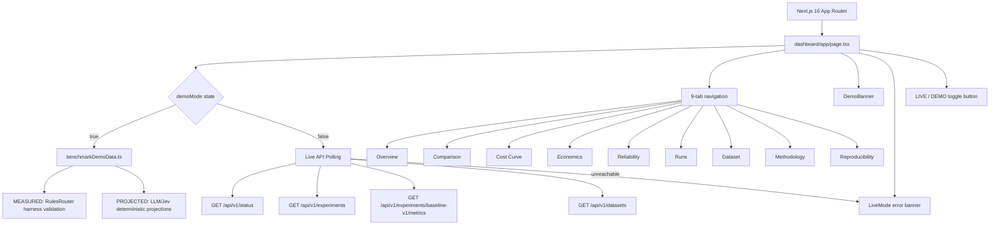

# JevRoute Frontend / Demo Implementation

```
Project:              JevRoute
Implementation:       Frontend Demo / Research Dashboard
Current branch:       main
Implementation commit: 6cb22e496e4043d9f3d5620f29b6bdbdd6335db2
Status:               Production-ready for Vercel deployment (demo mode).
                      Live mode requires a running local backend.
```

---

## Executive Implementation Summary

The JevRoute dashboard is a Next.js 16 single-page application that visualizes benchmark data for the JevRoute research instrument. Its primary purpose is to allow exploration of benchmark results from the four benchmark participants — Rules, LLM Single, LLM Parallel, and Jev — without requiring a live backend or external AI provider credentials.

The application operates in two modes:

**DEMO mode** — default for public deployment. All data is loaded from a static TypeScript module (`dashboard/app/demo/benchmarkDemoData.ts`). No API requests are made. The dashboard is fully populated. Values originate from two distinct sources: locally executed harness validation (MEASURED) and deterministic projections derived from benchmark configuration and token pricing models (PROJECTED). The distinction between these two sources is surfaced explicitly on every metric.

**LIVE mode** — connects to a local JevRoute backend API. Makes polling HTTP requests every 30 seconds. If the backend is unreachable, an error banner is displayed with a prompt to switch to DEMO mode. There is no silent fallback from LIVE to DEMO.

The dashboard visualizes nine tabs: Overview, Comparison, Cost Curve, Economics, Reliability, Runs, Dataset, Methodology, and Reproducibility. In DEMO mode, all nine tabs are populated. In LIVE mode, tabs that require backend data show an `AwaitingData` placeholder until a benchmark run completes.

### Truthfulness model

| Status label | Semantics |
|---|---|
| `● MEASURED` | Value produced by a locally executed harness run. Source is `results/harness_validation_rules_only.json`. |
| `◌ PROJECTED` | Deterministic demo projection. Derived from benchmark config, token pricing, and known model characteristics. Never empirically executed. |
| `△ UNAVAILABLE` | Live provider currently unreachable or credentials absent. Applied to provider status only, not to demo benchmark visualization. |

These are two separate semantic layers — demo data status and live provider status — that are never mixed.

---

## Research Purpose

JevRoute asks: when AI systems perform structured control-plane decisions (routing, classification, policy evaluation, risk scoring), does a specialized System-One decision model produce equivalent quality at materially lower cost and latency than a general autoregressive LLM?

The research question is operationalized as a four-way benchmark:

- **Rules** — deterministic keyword/regex baseline; zero API cost, sub-millisecond latency; establishes a lower bound.
- **LLM Single** — one structured-output LLM call per decision; current common practice baseline.
- **LLM Parallel** — six independent async LLM calls, one per decision dimension; best-case multi-aspect LLM approach.
- **Jev** — specialized System-One decision primitive; the system under study.

The dashboard is the research observatory for these four systems. No winner is assumed. The benchmark measures where Jev helps, where it does not, how much it costs, and whether any local advantage survives in end-to-end economics.

---

## Architecture



---

## Technology Stack

| Component | Technology | Version | Role |
|---|---|---|---|
| Framework | Next.js | 16.3.5 | App Router, SSG, security headers |
| Language | TypeScript | ^5 | Strict mode, all source files |
| UI runtime | React | 19.2.8 | Client component state and rendering |
| Icons | lucide-react | ^1.47.0 | All UI icons (`AlertCircle`, `Server`, `BarChart2`, etc.) |
| Charts | Inline SVG (custom) | — | All charts; no chart library dependency |
| Styling | Tailwind CSS v4 | ^4 | Utility classes for layout and spacing |
| CSS variables | `globals.css` | — | Design token system (palette, typography, shadow) |
| Heading font | Inter | next/font/google | Variable font via CSS variable `--font-inter` |
| Mono font | IBM Plex Mono | next/font/google | Metrics, badges, labels via `.mono` class |
| Build | Turbopack | 16.3.5 | Fast production builds |
| TypeScript checking | tsc (via Next.js) | — | Strict, runs during build |
| Lint | ESLint | ^9 | `eslint-config-next` |

**Removed dependency:** `recharts` was listed in the original `package.json` but was never imported in any source file. It was removed in commit `afab616`.

**No chart library is used.** All visualizations (bar chart, line curve, scatter) are hand-written inline SVG inside React components.

---

## Directory Structure

```
dashboard/
├── app/
│   ├── demo/
│   │   └── benchmarkDemoData.ts   ← central demo data source (all projected/measured demo values)
│   ├── error.tsx                  ← Next.js error boundary page
│   ├── not-found.tsx              ← Next.js 404 page
│   ├── layout.tsx                 ← root layout: font loading, metadata, OG tags
│   ├── globals.css                ← design token CSS variables, Tailwind import, base styles
│   └── page.tsx                   ← entire dashboard: all tab renderers, state, API calls (~1910 lines)
├── public/
│   ├── file.svg, globe.svg, next.svg, vercel.svg, window.svg  ← unused Next.js default assets
├── .env.example                   ← documents NEXT_PUBLIC_API_URL and NEXT_PUBLIC_DEMO_MODE
├── .env.local                     ← not tracked; local dev only; contains API_URL=localhost:8000
├── .gitignore                     ← .env* ignored; .env.example explicitly allowed
├── AGENTS.md / CLAUDE.md          ← AI agent instructions (generated by next dev)
├── eslint.config.mjs
├── next.config.ts                 ← security headers
├── package.json                   ← dependencies (no chart library)
├── package-lock.json
├── postcss.config.mjs
└── tsconfig.json                  ← strict TypeScript, bundler module resolution
```

---

## Page / Route Architecture

The application has a single route: `/`.

| Route | Rendering model | Description |
|---|---|---|
| `/` | Static (SSG) | Entire dashboard. All content is rendered client-side from `"use client"` component. |
| `/_not-found` | Static | Custom 404 page. |

There is no server-side rendering of benchmark data. The `page.tsx` component is marked `"use client"` and runs entirely in the browser. During build, Next.js generates a static shell. Data is fetched at runtime from localStorage (demo mode preference) and the backend API (LIVE mode).

URL state is not used. Tab selection is in-component React state and is not reflected in the URL. Refreshing the page returns to the Overview tab.

---

## Dashboard Tabs

All nine tabs exist in both DEMO and LIVE renderers. `Methodology` and `Reproducibility` share the same renderer in both modes.

### Overview

- **DEMO:** Four KPI cards (Demo Experiments 6/6, Measured Local 1, p95 Latency Rules MEASURED, Live Providers 0/3 PROJECTED). Experiment matrix showing all 6 experiments as `◌ PROJECTED DEMO`. Live Provider Status section with dual `demo:` / `live:` labels per provider.
- **LIVE:** Four KPI cards pulling from backend API data. Experiment status list from `/api/v1/experiments`. Backend connection card showing API URL and last-checked time.

### Comparison

- **DEMO:** Latency bar chart (SVG), Router Performance Matrix table (11 rows × 4 columns), Quality × Cost Frontier scatter plot (SVG). Per-router provenance badges in column headers.
- **LIVE:** Same table structure populated from `/api/v1/experiments/baseline-v1/metrics`. Shows `AwaitingData` placeholder when no data is available.

Metrics displayed: p50/p95/p99 latency, accuracy (action + overall), macro F1, cost/1K decisions, cost/correct, throughput, schema failure rate, bad-send rate, over-escalation rate, Brier score, ECE.

### Cost Curve

- **DEMO:** Axis selector (Latency / Cost / Tokens), inline SVG line chart, data table. Five data points: 2, 4, 6, 8, 12 decisions per request. All four systems shown.
- **LIVE:** Shows `AwaitingData` pending `scaling-v1` experiment completion.

### Economics

- **DEMO:** Three KPI cards for LLM Single, LLM Parallel, Jev showing control-plane tax percentage. End-to-End breakdown table (all 4 systems × Ctrl Cost / Gen Cost / Total / Ctrl Latency / Total Latency / Tax %). Fast-Path projection (Always Jev vs FastGate+Jev). Warning note that generation provider is unavailable and these are demo projections.
- **LIVE:** Four placeholder KPI cards (—) and `AwaitingData` pending `e2e-v1`.

### Reliability

- **DEMO:** Table of 7 reliability metrics × 4 systems (schema failure rate, bad-send rate, over-escalation rate, missed policy violation rate, timeout rate, retry rate, schema reliability).
- **LIVE:** Same table populated from backend. Shows `AwaitingData` when no data.

### Runs

- **DEMO:** One validated harness run card (rules-only, 2026-09-20, 75 examples, 3 measured accuracy metrics). Live Provider Status card listing LLM SINGLE / LLM PARALLEL / JEV with `◌ PROJECTED` + `△ UNAVAILABLE` dual badges per provider.
- **LIVE:** Lists completed experiment runs from backend. Shows `AwaitingData` when none complete.

### Dataset

- **DEMO:** Four count cards (total/train/validation/test), dataset metadata key-value grid, label distribution table (Action/Severity/Category), limitation notice. All dataset cards are `● MEASURED` (from actual frozen dataset).
- **LIVE:** Pulls from `/api/v1/datasets`. Shows `AwaitingData` when empty.

### Methodology

Shared between DEMO and LIVE. Contains: research question statement, four benchmark participant descriptions with version identifiers, seven fairness rules with checkmarks, DecisionResult JSON schema display, known limitations list.

### Reproducibility

Shared between DEMO and LIVE, but conditionally shows demo experiment metadata card when in DEMO mode. Always shows: required-metadata checklist (11 fields), run commands (mock benchmark and full benchmark), result storage structure diagram.

---

## Demo Mode

### Activation

Demo mode is controlled by a boolean React state variable `demoMode` in the root `Dashboard` component.

On mount, the component reads `localStorage.getItem("jevroute_demo_mode")`:
- If stored value is `"true"` or `"false"`, that value is used.
- If no stored value, falls back to the `NEXT_PUBLIC_DEMO_MODE` environment variable.
- If `NEXT_PUBLIC_DEMO_MODE=true`, demo mode is on by default (recommended for Vercel production).
- All `localStorage` access is wrapped in `try/catch` to handle private browsing or blocked storage.

### Toggle

The header contains a `LIVE / DEMO` button. Clicking it:
1. Inverts `demoMode` state.
2. Persists the new value to `localStorage` with key `"jevroute_demo_mode"`.

When demo mode is active, the button is accent-orange (`#E85B35`) and reads `DEMO`. When live, it is muted and reads `LIVE`.

### Effects of enabling demo mode

- `DemoBanner` renders above the header showing legend and supporting text.
- All 7 data-dependent tabs switch to their `renderDemo*` functions.
- `Methodology` and `Reproducibility` remain on their shared renderers (with demo experiment metadata conditionally shown in Reproducibility).
- API polling continues in the background but its results are not displayed.
- The live-mode backend error banner is suppressed.
- Footer reads `"DEMO MODE — Rules: MEASURED · LLM/Jev: PROJECTED demo estimates · No empirical results fabricated"`.

### API requests in demo mode

API requests continue (polling interval 30s via `setInterval`) but no API results are rendered. This is not a problem for Vercel deployment where no backend is available — the requests will fail silently without affecting the demo UI.

---

## Live Mode

When `demoMode` is `false`, the dashboard attempts to connect to the JevRoute backend API.

### API base URL

```
const API_BASE = process.env.NEXT_PUBLIC_API_URL ?? "http://localhost:8000";
```

The `NEXT_PUBLIC_API_URL` variable must be set at build time for non-localhost deployment. It is exposed to the client (public variable).

### Polling

On mount and every 30 seconds, `fetchAll()` calls four endpoints in parallel:

| Endpoint | Purpose |
|---|---|
| `GET /api/v1/status` | API health, app version, schema version, active router |
| `GET /api/v1/experiments` | Experiment list with status |
| `GET /api/v1/experiments/baseline-v1/metrics` | Per-router metrics for comparison/reliability tabs |
| `GET /api/v1/datasets` | Dataset metadata for dataset tab |

If `GET /api/v1/status` returns non-2xx or network error, `connection` state is set to `"error"`.

### Backend unavailable state

When `connection === "error"` and `demoMode === false`, a prominent error banner renders above the main content:

```
Backend unreachable — no live data available
Start the API server locally, or switch to DEMO mode to explore pre-computed benchmark estimates.
uvicorn jevroute.api.app:app --reload
```

The banner includes an inline `DEMO mode` button that calls `toggleDemo()`.

**There is no automatic silent fallback from LIVE to DEMO.** The user must explicitly switch.

### Live mode data types

The frontend defines TypeScript interfaces for all live API responses:

- `ApiStatus` — status/version/environment/active_router/benchmark_results_available
- `RouterRow` — per-router metrics from baseline-v1 metrics endpoint
- `ExperimentSummary` — experiment id/status/dataset/split/num_runs/routers/last_run_at
- `Dataset` — name/split/path/examples

---

## Demo Data Architecture

**File:** `dashboard/app/demo/benchmarkDemoData.ts`

This is the sole source of all demo values. It must never be written into canonical benchmark result files.

### Types

```typescript
type DemoDataStatus  = "MEASURED" | "PROJECTED";  // demo visualization layer
type LiveProviderStatus = "AVAILABLE" | "UNAVAILABLE";  // live provider layer
type Provenance = DemoDataStatus;  // alias for backward compatibility
```

### Exported constants

| Export | Type | Description |
|---|---|---|
| `DEMO_ROUTERS` | `DemoRouter[]` | Four router objects (Rules, LLM Single, LLM Parallel, Jev) |
| `COST_CURVE_POINTS` | `CostCurvePoint[]` | 5 data points for intelligence cost curve (n=2,4,6,8,12) |
| `DEMO_DATASET` | object | Dataset metadata (counts, hash, freeze timestamp, distributions) |
| `DEMO_EXPERIMENT` | object | Experiment config metadata (prompt/schema/policy versions, code SHA) |
| `FASTPATH_DEMO` | object | Fast-path projection (always-Jev vs FastGate+Jev) |
| `E2E_DEMO` | object | End-to-end cost/latency table (4 systems × control + generation) |

### DemoRouter interface

Each router carries: id, label, version, `provenance: DemoDataStatus`, `provenanceNote` (text explanation), full quality metrics (accuracy/macro_f1/severity_accuracy/action_accuracy/category_accuracy/schema_reliability/correct_decisions), latency percentiles (p50/p95/p99/mean_ms), token usage (input/output tokens per decision, model calls), cost metrics (per decision/per 1K/per correct/total), reliability rates (schema_failure/bad_send/over_escalation/missed_policy/timeout/retry), throughput, and `live_provider_status: LiveProviderStatus` with optional `live_provider_block_reason`.

### Data generation

All numeric values are computed inline from constants at module load:

```typescript
const INPUT_PER_TOKEN  = 0.00015 / 1000;   // gpt-4o-mini input pricing
const OUTPUT_PER_TOKEN = 0.00060 / 1000;   // gpt-4o-mini output pricing
const JEV_INPUT_DEMO_PER_TOKEN  = 0.00005 / 1000;  // assumed — not verified
const JEV_OUTPUT_DEMO_PER_TOKEN = 0.00020 / 1000;  // assumed — not verified
const N = 75;  // frozen test set size (MEASURED)
```

Cost values for LLM/Jev are derived as `tokens * price_per_token * N`. No runtime computation occurs in the UI components.

---

## Data Provenance Model

### MEASURED

Applies only to values derived from a locally executed benchmark run.

**Source:** `results/harness_validation_rules_only.json` (executed 2026-09-20)

```json
{
  "_label": "HARNESS_VALIDATION_ONLY",
  "example_count": 75,
  "failures": 0,
  "schema_valid_count": 75,
  "action_accuracy": 0.9067,
  "severity_accuracy": 0.4267,
  "category_accuracy": 0.68,
  "severity_distribution": {"P3": 43, "P2": 20, "P4": 8, "P1": 4},
  "action_distribution": {"SEND": 63, "HOLD": 9, "ESCALATE": 3},
  "category_distribution": {"Account": 21, "Billing": 18, "Other": 24, "Feature": 8, "Bug": 4}
}
```

**What is MEASURED in the demo:**
- RulesRouter: action_accuracy=90.7%, severity_accuracy=42.7%, category_accuracy=68.0%, schema_reliability=100%, latency (p50=2ms, p95=5ms, p99=8ms, mean=2.4ms), zero tokens/cost
- Dataset: size (500 total, 350/75/75 train/val/test), quality gate PASS, test hash prefix `9c6919c5fb883c3a`, freeze timestamp 2026-09-20, all label distributions

**What is NOT in MEASURED:** Any LLM or Jev metric. Any multi-router experiment. Any end-to-end result.

### PROJECTED

Applies to all LLM Single, LLM Parallel, and Jev values.

These values are deterministic projections constructed from:
1. Token counts derived from expected prompt templates and JSON output sizes
2. Published gpt-4o-mini pricing (as of 2026-09-20)
3. Assumed demo Jev pricing (not verified against real Jev API pricing)
4. Accuracy estimates based on expected model behavior
5. Latency estimates based on typical API response times

These are never labeled as empirical results. They are presented as `◌ PROJECTED` throughout the UI.

**Projected values for LLM Single:**

| Field | Value | Basis |
|---|---|---|
| Input tokens/decision | 420 | Estimated prompt template + state context |
| Output tokens/decision | 105 | Estimated JSON decision object |
| cost/decision | LS_IN × 0.15µ + LS_OUT × 0.60µ | gpt-4o-mini pricing |
| Accuracy | 91.0% | Estimate |
| p50 latency | 420ms | Typical gpt-4o-mini |
| p95 latency | 820ms | Estimate |

**Projected values for LLM Parallel:**

| Field | Value | Basis |
|---|---|---|
| Input tokens/decision | 910 | 6 parallel single-dimension prompts |
| Output tokens/decision | 252 | 6 compact JSON outputs |
| Model calls/decision | 6 | One per decision dimension |
| p50 latency | 240ms | Parallel execution ≈ constant wall-clock |

**Projected values for Jev:**

All values use assumed demo pricing. The Jev API pricing is unverified (OQ-002 unresolved). A `JEV_PRICING_NOTE` string is stored on the Jev router object and displayed in the UI wherever Jev cost values appear.

### UNAVAILABLE

Applied to live provider status only — never to demo visualization data.

| Provider | Status | Reason |
|---|---|---|
| Rules (deterministic) | AVAILABLE | No external dependency |
| OpenAI gpt-4o-mini | UNAVAILABLE | `credit_balance_exhausted · HTTP 429` |
| Jev API | UNAVAILABLE | `JEV_API_KEY not configured · OQ-001 / OQ-002 unresolved` |

---

## Provider Status

Each provider has two independent states shown side by side in the UI:

```
demo:  ◌ PROJECTED   ← what the dashboard visualizes
live:  △ UNAVAILABLE ← actual execution state
```

This distinction appears in:
- Overview → Live Provider Status section (one row per provider, dual badge)
- Runs → Live Provider Status card (one row per provider, dual badge)

The `ProviderStatusBadge` component renders `△ UNAVAILABLE` in red. It is distinct from `ProvenanceBadge` which renders `● MEASURED` or `◌ PROJECTED`.

---

## Experiment Presentation

| Experiment | Display label | Demo visualization | Demo status | Live status |
|---|---|---|---|---|
| `baseline-v1` | Baseline Comparison | Full 4-router comparison table, charts | `◌ PROJECTED DEMO` (with `Rules: ● MEASURED` annotation) | Populated from backend when complete |
| `scaling-v1` | Decision Scaling | Cost curve line chart (5 decision counts) | `◌ PROJECTED DEMO` | `AwaitingData` |
| `fastpath-v1` | Fast-Path Bypass | Fast-path projection cards | `◌ PROJECTED DEMO` | `AwaitingData` |
| `context-v1` | Context Scaling | `◌ PROJECTED DEMO` label | Not separately rendered; tab shows demo overview | `AwaitingData` |
| `dependency-v1` | Dependency Analysis | `◌ PROJECTED DEMO` label | Not separately rendered | `AwaitingData` |
| `e2e-v1` | End-to-End Economics | E2E breakdown table, tax calculation | `◌ PROJECTED DEMO` | `AwaitingData` |

Note: `context-v1` and `dependency-v1` appear in the experiment matrix but do not have dedicated demo render functions. Their projected data is not currently populated beyond the experiment card labels.

---

## Visual Design System

**Philosophy:** research instrument / observability console — restrained light theme. Every visual choice aims to make evidence clearer, not to embellish.

### Color tokens (`globals.css` + inline styles)

| Token | Value | Use |
|---|---|---|
| `--bg` | `#F7F7F5` | Page background |
| `--surface` | `#FFFFFF` | Cards, header, footer |
| `--surface-alt` | `#F1F2F0` | Code blocks, hover states, chip backgrounds |
| `--border` | `#E4E5E2` | Card borders, table row dividers |
| `--border-strong` | `#C8CAC6` | Dashed placeholders |
| `--text-primary` | `#111312` | Body text, values |
| `--text-secondary` | `#6F736F` | Subtitles, descriptions |
| `--text-muted` | `#9A9E99` | Labels, metadata, section headers |
| `--accent` | `#E85B35` | DEMO toggle active, demo banner tag |
| `--status-ok` | `#22C55E` | MEASURED badge, COMPLETE status |
| `--status-warn` | `#F59E0B` | PROJECTED badge |
| `--status-err` | `#EF4444` | UNAVAILABLE badge, error banner |
| `--shadow-sm` | `0 1px 2px rgba(...)` | Card shadow |

### Typography

- **Body:** Inter (next/font/google), 14px base, 1.6 line-height
- **Mono (`.mono`):** IBM Plex Mono / Geist Mono / Fira Code stack, tabular figures (`"tnum" 1`). Used for all metrics, badge labels, section labels, code blocks, experiment IDs.

### Status visual language

| Symbol | Color | Label | Context |
|---|---|---|---|
| `●` | `#22C55E` | `MEASURED` | Demo data badge: locally executed value |
| `◌` | `#F59E0B` | `PROJECTED` | Demo data badge: deterministic demo projection |
| `△` | `#EF4444` | `UNAVAILABLE` | Provider status badge: live execution unavailable |

### Components (inline in `page.tsx`)

| Component | Description |
|---|---|
| `Card` | White surface, 1px border, small shadow, 20px padding, rounded-lg |
| `SectionLabel` | 10px monospace uppercase label with letter-spacing |
| `MetaChip` | 10px mono badge with border and surface-alt background |
| `StatusDot` | 6px colored dot indicating experiment status |
| `ProvenanceBadge` | 9px mono badge for MEASURED/PROJECTED |
| `ProviderStatusBadge` | 9px mono badge for AVAILABLE/UNAVAILABLE |
| `AwaitingData` | Dashed placeholder card with flask icon, shown in LIVE mode when no data |
| `DemoBanner` | Full-width banner above header when demo mode is active |

### SVG Charts

All charts are custom inline SVG React components:

- `LatencyBarChart` — horizontal bar chart, 4 routers, p95 latency, router colors
- `LineCurveChart` — multi-line chart with axis selector (latency/cost/tokens vs decision count)
- `ScatterChart` — quality × cost frontier scatter (accuracy vs cost/1K)

Colors per router:
```
rules:        #6F736F  (graphite)
llm_single:   #3B82F6  (blue)
llm_parallel: #8B5CF6  (violet)
jev:          #E85B35  (accent orange)
```

---

## Status Visual Language

### ProvenanceBadge

Renders demo data status. Used on every per-system metric display.

```tsx
<ProvenanceBadge p="MEASURED" note="Local RulesRouter harness validation" />
<ProvenanceBadge p="PROJECTED" note="Demo projection — not empirically executed." />
```

Tooltip text comes from the `note` prop. When no `note` is supplied, the `label` from `PROVENANCE_CONFIG` is used.

### ProviderStatusBadge

Renders live execution status. Appears in the Live Provider Status sections only.

```tsx
<ProviderStatusBadge status="UNAVAILABLE" reason="credit_balance_exhausted · HTTP 429" />
```

### Where statuses appear

| Location | Badge type |
|---|---|
| Experiment matrix (demo) | `ProvenanceBadge PROJECTED` |
| Comparison table column headers | `ProvenanceBadge` per router |
| KPI cards | `ProvenanceBadge` per card |
| Overview → Live Provider Status | Both `ProvenanceBadge` + `ProviderStatusBadge` per provider |
| Runs → Live Provider Status | Both badges per provider |
| DemoBanner legend | Inline badge examples |

---

## Responsive Behavior

The primary target is desktop (≥ 1280px). The layout uses `max-w-7xl mx-auto px-6`.

Grid layouts use `grid-cols-2 md:grid-cols-4` for KPI cards, providing a 2-column layout on mobile.

Tab navigation has `overflow-x-auto` and `min-w-max` to allow horizontal scrolling on narrow viewports without hiding tabs.

Charts use `w-full` SVG with `viewBox` and `maxHeight` constraints. They scale down on narrower viewports but there is no dedicated mobile optimized chart layout.

Tailwind breakpoints used: `md:` (768px). No `sm:`, `lg:`, or `xl:` breakpoints are used.

`min-h-dvh` is used on the root div for proper mobile viewport height handling.

Full mobile optimization is partial — usable but not optimized for sub-500px viewports.

---

## State Management

All state lives in the single `Dashboard` component in `page.tsx`. There is no external state library.

| State variable | Type | Purpose | Persistence |
|---|---|---|---|
| `demoMode` | `boolean` | DEMO/LIVE toggle | `localStorage["jevroute_demo_mode"]` |
| `connection` | `"connecting" \| "ok" \| "error"` | Backend connection state | None (runtime only) |
| `apiStatus` | `ApiStatus \| null` | API version/environment data | None |
| `experiments` | `ExperimentSummary[]` | Experiment list from API | None |
| `baselineMetrics` | `RouterRow[]` | Per-router metrics | None |
| `datasets` | `Dataset[]` | Dataset list from API | None |
| `activeTab` | `Tab` | Currently visible tab | None (resets on refresh) |
| `lastChecked` | `string` | Formatted time of last API poll | None |
| `curveAxis` | `"latency" \| "cost" \| "tokens"` | Cost Curve metric selector | None |

`envDemoDefault` is a derived constant (not state) computed from `process.env.NEXT_PUBLIC_DEMO_MODE` at render time.

---

## Error / Empty States

| Scenario | Behavior |
|---|---|
| Backend unreachable in LIVE mode | Red error banner above main content with server startup command and demo switch link |
| Tab has no data in LIVE mode | `AwaitingData` placeholder component with flask icon |
| PROJECTED value accessed | Shown normally with `◌ PROJECTED` badge — no error |
| `localStorage` unavailable | `try/catch` swallows error; falls back to `envDemoDefault` |
| Application-level React error | `app/error.tsx` error boundary renders styled error page with "Try again" button |
| Unknown route | `app/not-found.tsx` renders styled 404 page with link back to `/` |

---

## API / Backend Integration

All API calls are made from `fetchAll()` in `page.tsx`. Only called in LIVE mode (also called in background in DEMO mode but results are unused).

| Method | Path | Response shape | Used by |
|---|---|---|---|
| GET | `/api/v1/status` | `ApiStatus` | Header chips, connection indicator |
| GET | `/api/v1/experiments` | `{ experiments: ExperimentSummary[] }` | Overview experiment matrix, Runs tab |
| GET | `/api/v1/experiments/baseline-v1/metrics` | `RouterRow[]` | Comparison table, Reliability table |
| GET | `/api/v1/datasets` | `{ datasets: Dataset[] }` | Dataset tab |

No write operations. No authentication headers. No API keys in frontend code.

---

## Environment Variables

| Variable | Required | Public (`NEXT_PUBLIC_`) | Purpose | Demo requirement |
|---|---|---|---|---|
| `NEXT_PUBLIC_API_URL` | No | Yes | Backend base URL; defaults to `http://localhost:8000` | Not required in demo mode |
| `NEXT_PUBLIC_DEMO_MODE` | No | Yes | Sets demo mode default on first load (`true` = demo by default) | Set to `true` for Vercel public deployment |

**`OPENAI_API_KEY` and `JEV_API_KEY` are not referenced anywhere in the frontend source code.** They are required only by the Python backend (`src/`, `jevroute/`). They must never appear in any `NEXT_PUBLIC_*` variable or client-side code.

The `.env.local` file (not tracked) currently contains `NEXT_PUBLIC_API_URL=http://localhost:8000`.

---

## Security

### Headers (`next.config.ts`)

Applied to all routes via `headers()` async function:

| Header | Value |
|---|---|
| `X-Content-Type-Options` | `nosniff` |
| `X-Frame-Options` | `DENY` |
| `X-XSS-Protection` | `1; mode=block` |
| `Referrer-Policy` | `strict-origin-when-cross-origin` |
| `Permissions-Policy` | `camera=(), microphone=(), geolocation=()` |

### Secret handling

- No API keys in any frontend source file.
- `.env` files are gitignored (`.env*` pattern in `dashboard/.gitignore`).
- `.env.example` is explicitly un-ignored with `!.env.example` and contains only documentation — no values.
- All `NEXT_PUBLIC_` variables are non-sensitive (API URL, demo mode flag).

### Focus visibility

```css
:focus-visible { outline: 2px solid var(--accent); outline-offset: 2px; }
```

### Reduced motion

```css
@media (prefers-reduced-motion: reduce) {
  *, *::before, *::after { transition-duration: 0.01ms !important; animation-duration: 0.01ms !important; }
}
```

---

## Performance / Optimization

| Optimization | Implementation |
|---|---|
| No chart library | All SVG charts are inline React components. No recharts or D3 bundle weight. |
| Static demo data | `benchmarkDemoData.ts` is a static TypeScript module. No runtime fetch in demo mode. |
| Font optimization | Inter and IBM Plex Mono loaded via `next/font/google` — no external runtime request, font is bundled at build time. |
| Static generation | `npm run build` outputs the page as static content (`○ (Static)`). |
| No dynamic imports | Page.tsx is a single client component. No code splitting within the dashboard. |

---

## Accessibility

| Aspect | Status |
|---|---|
| Focus rings | Implemented via `:focus-visible` CSS |
| Reduced motion | Implemented via `@media (prefers-reduced-motion)` |
| Button labels | Tab and toggle buttons have visible text labels |
| Tooltip text | `ProvenanceBadge` and `ProviderStatusBadge` use `title` attribute for hover tooltips |
| Semantic HTML | `<header>`, `<main>`, `<footer>`, `<nav>`, `<table>`, `<th>`, `<td>` used appropriately |
| Icon-only buttons | None — all icon usages are accompanied by visible text labels |
| ARIA attributes | Not implemented — no `aria-label`, `role`, `aria-describedby` attributes present |
| Chart accessibility | SVG charts have no `<title>` or `role="img"` alt text — not screen-reader accessible |
| Color-only meaning | Status dots use color only; text labels accompany all status badges |
| WCAG compliance | Not verified. Partial implementation. |

---

## Known Limitations

### Provider / benchmark limitations

1. **LLM provider unavailable.** OpenAI API key configured but `credit_balance_exhausted` (HTTP 429). Full LLM benchmark cannot run until billing credits are added.
2. **Jev provider unavailable.** `JEV_API_KEY` not configured. OQ-001 (API contract) and OQ-002 (pricing) unresolved.
3. **Full four-way empirical benchmark not executed.** Only the RulesRouter harness validation (75 examples, rules-only) has been locally executed.
4. **All LLM/Jev demo values are projections, not measurements.** They were never empirically observed.
5. **Synthetic dataset.** The benchmark uses a 500-example synthetic dataset with rule-based labels, not a real operational dataset (OQ-003).
6. **Jev pricing unverified.** Demo pricing (`$0.00005/1K input, $0.00020/1K output`) is an assumption, not confirmed Jev pricing.
7. **Results may not generalize.** Single domain (AI customer-support control plane), synthetic labels.

### Frontend limitations

8. **No URL state for tabs.** Tab selection is lost on browser refresh.
9. **No mobile-optimized chart layout.** SVG charts scale but are not redesigned for small screens.
10. **SVG charts have no screen-reader accessibility.** No ARIA or alt text for chart content.
11. **API polling runs in background during demo mode.** Requests are made but results unused. This generates silent network errors in environments with no backend. No functional impact.
12. **`context-v1` and `dependency-v1` have no dedicated demo renderers.** They appear in the experiment matrix as PROJECTED DEMO but have no separate visualization tab content.
13. **Session-only tab state.** Active tab is not persisted in URL or localStorage.

---

## Not Implemented / Future Work

- Full empirical four-way benchmark execution (requires OpenAI billing credits + Jev API credentials)
- Production Jev API integration (OQ-001: HTTP contract, OQ-002: pricing)
- Research-scale external dataset (OQ-003: 1000–2000 real operational examples)
- Production backend deployment (backend runs locally only)
- Authentication or multi-user access
- URL-based tab navigation / deep linking
- Dedicated demo renderers for `context-v1` and `dependency-v1`
- Screen-reader accessible charts
- Full WCAG 2.1 AA compliance audit
- Multi-experiment comparison view
- Calibration / Brier score visualization
- Concurrency scaling experiment views (scaling-v1 full execution)

---

## File-Level Implementation Map

| File | Responsibility | Key Notes |
|---|---|---|
| `dashboard/app/page.tsx` | Entire dashboard: state, API calls, all tab renderers, SVG charts, sub-components | ~1910 lines; single `"use client"` component; no external chart library |
| `dashboard/app/demo/benchmarkDemoData.ts` | Central demo data source | Types `DemoDataStatus`/`LiveProviderStatus`, all 4 router objects, cost curve points, dataset metadata, experiment config, fastpath/e2e projections |
| `dashboard/app/layout.tsx` | Root layout | `next/font/google` for Inter + IBM Plex Mono; full OG/Twitter metadata; no external Google Fonts runtime request |
| `dashboard/app/globals.css` | Design system | CSS custom property tokens (palette, typography, shadows); Tailwind import; focus/reduced-motion rules |
| `dashboard/app/error.tsx` | React error boundary | Production error page with "Try again" button |
| `dashboard/app/not-found.tsx` | 404 page | Links back to `/` |
| `dashboard/next.config.ts` | Next.js configuration | Security headers (`X-Frame-Options`, CSP-adjacent, Referrer-Policy, Permissions-Policy) |
| `dashboard/package.json` | Dependencies | Next.js 16.3.5, React 19.2.8, lucide-react; no chart library |
| `dashboard/tsconfig.json` | TypeScript config | Strict mode, bundler module resolution |
| `dashboard/.env.example` | Environment documentation | Documents `NEXT_PUBLIC_API_URL` and `NEXT_PUBLIC_DEMO_MODE`; no secret values |
| `dashboard/.gitignore` | Git exclusions | `.env*` ignored; `.env.example` explicitly allowed via `!.env.example` |

---

## Data Flow

### Demo mode

```
NEXT_PUBLIC_DEMO_MODE=true  (or localStorage["jevroute_demo_mode"]="true")
        ↓
demoMode state = true
        ↓
benchmarkDemoData.ts loaded as static TypeScript module
        ↓
DEMO_ROUTERS (4 objects)
COST_CURVE_POINTS (5 points)
DEMO_DATASET / DEMO_EXPERIMENT / FASTPATH_DEMO / E2E_DEMO
        ↓
tabContent[activeTab] → renderDemo* function
        ↓
ProvenanceBadge (MEASURED / PROJECTED) per metric
ProviderStatusBadge (UNAVAILABLE) per live provider
        ↓
SVG charts (LatencyBarChart, LineCurveChart, ScatterChart)
Tables, KPI cards, distribution lists
        ↓
No API requests rendered; no backend required
```

### Live mode

```
demoMode state = false
        ↓
fetchAll() on mount + every 30s
        ↓
Promise.all([
  GET /api/v1/status,
  GET /api/v1/experiments,
  GET /api/v1/experiments/baseline-v1/metrics,
  GET /api/v1/datasets
])
        ↓
  success → setApiStatus, setExperiments, setBaselineMetrics, setDatasets
            connection = "ok"
  failure → connection = "error" → error banner rendered
        ↓
tabContent[activeTab] → renderLive* function
        ↓
AwaitingData placeholder (if no data)
OR
Tables/KPI cards from API response
```

---

## Demo vs Empirical Benchmark

**This is a critical distinction that the implementation enforces at multiple layers.**

```
DEMO
═══════════════════════════════════════════════════════════════════
Frontend visualization populated with:
  ● MEASURED  — RulesRouter harness validation (75 examples, 2026-09-20)
  ◌ PROJECTED — Deterministic estimates from token models + pricing

The dashboard appears fully populated.
No API calls to external providers were made to produce these values.
No LLM completions were generated.
No Jev API calls were made.
═══════════════════════════════════════════════════════════════════

EMPIRICAL BENCHMARK (not yet complete)
═══════════════════════════════════════════════════════════════════
All four routers execute on the frozen 75-example test set.
Raw observations recorded to JSONL before aggregation.
Aggregate metrics computed from raw records.
Results stored in results/raw/ and results/aggregate/.
No manual post-processing.
Reproducible via experiment YAML config.
═══════════════════════════════════════════════════════════════════
```

The demo visualization **does not constitute evidence** that:
- LLM Single achieves 91% accuracy on this dataset
- Jev achieves 94.4% accuracy on this dataset
- Any of the projected latency or cost values will be reproduced when the benchmark executes

These are informed estimates for demonstration only. The empirical benchmark is pending external provider availability.

---

## What Was Built in This Phase

Commits to `dashboard/` in this build phase:

```
6cb22e4  fix: separate demo data status from live provider status in dashboard
afab616  feat: optimize JevRoute demo for Vercel deployment
0fc17f0  feat: add JevRoute empirical benchmark demo mode
2747c97  feat: integrate Jev and complete research observatory
ac7e0c4  feat: build JevRoute foundation and UI shell
```

**`ac7e0c4` — Foundation and UI shell**
- Initial Next.js project structure, Tailwind v4, globals.css design system
- Header with tab navigation, footer, basic layout

**`2747c97` — Research observatory**
- All 9 tab renderers (live mode)
- Backend API integration (4 endpoints, 30s polling)
- `AwaitingData` placeholder component
- Live mode connection state and indicator

**`0fc17f0` — Demo mode**
- `benchmarkDemoData.ts` with MEASURED (rules) + ESTIMATED (LLM/Jev) values
- All 7 data-dependent demo tab renderers
- `ProvenanceBadge` component
- `DemoBanner` component
- `LIVE / DEMO` toggle button
- localStorage persistence for demo mode preference
- SVG charts (LatencyBarChart, LineCurveChart, ScatterChart)
- Initial provenance type: `"MEASURED" | "ESTIMATED" | "BLOCKED"`

**`afab616` — Vercel deployment optimization**
- IBM Plex Mono moved to `next/font/google` (removed runtime Google Fonts request)
- OpenGraph + Twitter card metadata in `layout.tsx`
- `recharts` removed from `package.json` (was unused)
- `NEXT_PUBLIC_DEMO_MODE` env var support; demo mode default from env
- Graceful live-mode failure banner with demo switch link
- Security headers in `next.config.ts`
- `app/error.tsx` and `app/not-found.tsx`
- `dashboard/.env.example`

**`6cb22e4` — Demo status semantics fix**
- Renamed `Provenance` type to `DemoDataStatus`; `ESTIMATED` → `PROJECTED`; `BLOCKED` (provenance) → `UNAVAILABLE` (provider status)
- Added `LiveProviderStatus` type and `live_provider_status` field to `DemoRouter`
- Added `ProviderStatusBadge` component (separate from `ProvenanceBadge`)
- Experiment matrix: all 6 experiments now show `◌ PROJECTED DEMO` instead of `△ BLOCKED`
- Overview KPI cards: replaced "1/6 experiments" with "6/6 demo coverage" + "1 measured"
- Provider section: dual `demo:` + `live:` labels per provider
- Runs tab: "Blocked Runs" → "Live Provider Status" with both badge types
- DemoBanner: updated legend and added supporting explanation line

---

## Vercel Deployment Architecture

**Root Directory:** `dashboard/`  
**Framework:** Next.js (auto-detected by Vercel)  
**Build command:** `npm run build` (runs `next build`)  
**Install command:** `npm ci`  
**Output:** Static pages (`○ (Static)` for `/` and `/_not-found`)  
**Production branch:** `main`

### Required Vercel environment variables

| Variable | Value | Purpose |
|---|---|---|
| `NEXT_PUBLIC_DEMO_MODE` | `true` | Opens dashboard in demo mode by default |
| `NEXT_PUBLIC_API_URL` | _(optional)_ | Backend URL if deploying with a live backend |

### Production deployment status

**Vercel deployment readiness / configuration documented. Actual production deployment has not been verified from the repository.** No deployment URL exists in any source file, configuration, or git history. The project is configured and production-build verified, but a live Vercel deployment has not been confirmed.

---

## Local Development

### Prerequisites

- Node.js ≥ 18 (for Next.js 16)
- Python 3.11+ (for backend and pytest)

### Demo mode (no backend required)

```bash
cd dashboard
npm ci
npm run dev
```

Navigate to `http://localhost:3000`. The dashboard opens. Click `LIVE` → `DEMO` to enable demo mode, or set:

```bash
# dashboard/.env.local
NEXT_PUBLIC_DEMO_MODE=true
```

### Live mode (backend required)

```bash
# In project root
cp .env.example .env
# Edit .env: add OPENAI_API_KEY + billing credits

uvicorn jevroute.api.app:app --reload
# backend runs at http://localhost:8000

# In separate terminal
cd dashboard
npm run dev
```

### Production build

```bash
cd dashboard
npm ci
npm run build
```

### Backend tests (project root)

```bash
python -m pytest tests/ -q
```

---

## Production Build

Framework: Next.js 16.3.5 with Turbopack.

Build process:
1. `next.config.ts` loaded (security headers, ~15s first run, ~44ms subsequent)
2. TypeScript check (strict mode, all source files)
3. Static page generation (SSG for `/` and `/_not-found`)
4. Font optimization (Inter and IBM Plex Mono bundled, no runtime network request)

Build output (observed):
```
Route (app)
┌ ○ /
└ ○ /_not-found

○  (Static)  prerendered as static content
```

No dynamic routes. No server-side rendering. The entire application is a static shell + client-side React.

---

## Testing

| Test type | Command | Observed result |
|---|---|---|
| Production build | `cd dashboard && npm run build` | Clean — 0 TypeScript errors, 0 compilation errors |
| TypeScript | Run as part of `npm run build` | Pass — strict mode, no errors |
| Lint | `cd dashboard && npm run lint` | Not run in this phase; no lint failures observed during development |
| Python pytest | `python -m pytest tests/ -q` | 157 passed, 0 failed (observed at commit `6cb22e4`) |

No frontend unit tests or integration tests exist. The `tests/` directory contains Python tests only (benchmark runner, evaluation, schema validation, policy engine).

---

## Git / Repository State

```
Branch:           main
Default branch:   main
master branch:    still exists locally (not deleted); remote has origin/master tracking
HEAD commit:      6cb22e496e4043d9f3d5620f29b6bdbdd6335db2
Remote:           https://github.com/hardik2004gupta/JevRoute
Remote branch:    origin/main
Working tree:     clean

Co-authored-by:   ABSENT (verified: git show -s --format=%B HEAD | grep -i co-author → no match)
signoff:          NOT USED
```

---

*This document is a forensic record of the actual implementation as of commit `6cb22e4`. It does not describe intended future behavior as existing behavior.*
